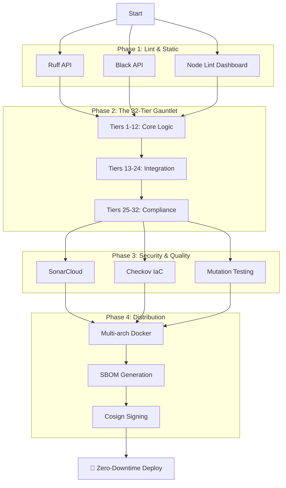

# 🌏 High-Assurance CI/CD Architecture

This document visualizes the 32-tier validation gauntlet and the Master Pipeline logic.

## Pipeline Flow

## Validation Tiers Breakdown

| Layer | Hierarchy | Focus |
|---|---|---|
| **Core** | Tiers 1-12 | Boundary Value Analysis, Security Timing, Idempotency, Schema Conformance |
| **Integration** | Tiers 13-24 | Transactional Outbox, Correlation Tracing, Rate Limiting, Complexity Matrix |
| **Compliance** | Tiers 25-32 | Disaster Recovery, SLSA Provenance, FDA Bundle Signing, DAST |

## Dependabot Stabilization
The pipeline is designed to be **Bot-Safe**:
- Non-critical scans (SonarCloud, ZAP) are bypassed for `dependabot[bot]` to prevent red PRs due to missing secrets.
- `JWT_SECRET` and `APP_AUTH_TOKEN` have secure defaults for testing environments.
- Dependency CVE scans are integrated via `Trivy` and `pip-audit`.
