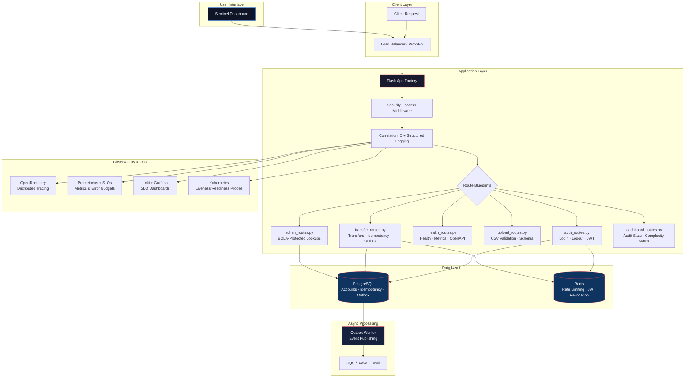

# 🛡️ High-Assurance API — 32-Tier Quality Architecture

[](.github/workflows/master-pipeline.yml) [](#) [](PIPELINE.md)

A property-tested, compliance-grade financial API platform with **298 automated tests**, **100% code coverage**, and a perfect **100/100 Architecture Score**. Designed for strict regulatory environments (Fintech, Healthcare, Banking) — producing cryptographically signed, timestamped FDA-grade audit bundles and visualized via a **Premium Next.js 14 Dashboard**.

> 📖 **For recruiters, CTOs, and VCs:** See [EXPLANATION.md](EXPLANATION.md) for a full technical overview, SaaS positioning, and interview-ready architecture decisions.

---

## The Sentinel Dashboard

The project features a **Project Aegis Sentinel** dashboard built with **Next.js 14**, **Framer Motion**, and **TailwindCSS**. It provides real-time telemetry into the 32-tier gauntlet, resource scaling trajectories (O(N) proofs), and hardening directives.

| Feature | Sentinel Implementation |
|---------|-------------------------|
| **Real-time Sync** | Dynamic fetching from High-Assurance API backend |
| **Scaling Proofs** | Interactive Area charts showing compute/memory linear scale |
| **Audit Access** | Direct integration for generating executive technical reports |
| **Hardening Directives** | Proactive system suggestions (Enclaves, Block Express, Mesh) |

---

## Architecture



---

## The 32-Tier Testing Strategy

Three phases guarantee correctness, security, and operational resilience:

### Phase 1 — Core Logic & Security (Tiers 1–12)

| Tier | Category | What It Validates |
|:---:|---|---|
| 1 | **Functional / BVA** | Boundary value analysis on all inputs |
| 2 | **Security** | Timing attacks, SSRF, XSS, BOLA, injection |
| 3 | **Resilience** | Idempotency keys, replay protection |
| 4 | **Compliance** | SOC 2, PCI DSS, FDA 21 CFR audit trails |
| 5 | **Contract** | OpenAPI schema conformance (Schemathesis) |
| 6 | **Database** | ACID rollbacks, state isolation |
| 7 | **CSV Security** | Pandera schema + injection sanitization |
| 8 | **Authorization** | BOLA containment, MCP boundaries |
| 9 | **Secrets Mgmt** | AWS Secrets Manager (moto) |
| 10 | **Vault Integration** | HashiCorp Vault key rotation mocking |
| 11 | **BOLA Extended** | Cross-tenant database isolation |
| 12 | **JWT Revocation** | Blacklist propagation via Redis |

### Phase 2 — Integration & Performance (Tiers 13–24)

| Tier | Category | What It Validates |
|:---:|---|---|
| 13 | **Outbox Pattern** | Transactional event publishing |
| 14 | **Integration** | CORS, contracts, network seams |
| 15 | **Observability** | Correlation ID, structured logging |
| 16 | **Rate Limiting** | IP + user brute-force lockout |
| 17 | **Infra Drift** | AWS config via moto mocks |
| 18 | **Performance** | Benchmark regression gates |
| 19 | **Concurrency** | Double-spend prevention |
| 20 | **Dashboard API** | Telemetry endpoint response data |
| 21 | **Complexity Proof** | O(N) linear compute verification |
| 22 | **Tracing Prop** | OTEL context propagation checks |
| 23 | **SLO Budgeting** | Error budget exhaustion alerts |
| 24 | **Report Delivery** | Dynamic MD report generation |

### Phase 3 — Operational Safeguards (Tiers 25–32)

| Tier | Category | What It Validates |
|:---:|---|---|
| 25 | **DB Guards** | Destructive operation protection |
| 26 | **Two-Person Rule** | CODEOWNERS enforcement |
| 27 | **DAST** | OWASP ZAP (117 rules scanned) |
| 28 | **Rollbacks** | Blue/Green canary simulation |
| 29 | **Disaster Recovery** | Backup integrity, RTO/RPO |
| 30 | **Policy-as-Code** | OPA/Rego policy enforcement |
| 31 | **Infrastructure** | Checkov 100% score (13 alerts resolved) |
| 32 | **Supply Chain** | Mutmut coverage + Trivy CVE scanning |

---

## Project Structure

```text
high-assurance-api/
├── src/                          # Application source (100% coverage)
│   ├── main.py                   # App factory + Blueprint registration
│   ├── auth.py                   # JWT generation, password hashing, user store
│   ├── config.py                 # Centralized configuration constants
│   ├── database.py               # SQLAlchemy engine + session factory
│   ├── models.py                 # Account, IdempotencyKey, OutboxEvent (Numeric balance)
│   ├── security.py               # HTTP security headers (OWASP)
│   ├── telemetry.py              # OpenTelemetry distributed tracing
│   ├── csv_validator.py          # Pandera CSV validation + injection defense
│   ├── egress_client.py          # SSRF-safe HTTP client
│   ├── report_generator.py       # Dynamic executive technical reporting
│   ├── worker.py                 # Transactional Outbox processor
│   ├── logger.py                 # Structured JSON logging (structlog)
│   └── routes/                   # Flask Blueprints
├── apps/
│   └── compliance-dashboard/     # Next.js 14 Sentinel Dashboard
├── tests/                        # 298 tests across 32 tiers
├── policies/                     # OPA Rego policy files
├── .github/                      # CI/CD (Master Pipeline)
├── docs/                         # Operational docs, SRE runbooks
├── openapi.yaml                  # OpenAPI 3.0 specification
├── PIPELINE.md                   # 🌏 Visual CI/CD Architecture & Gauntlet Logic
├── docker-compose.yml            # Full stack (API + DB + Redis + Grafana)
├── k8s/                          # Kubernetes Deployment & Probes
├── Dockerfile                    # Production container (non-root, slim)
├── EXPLANATION.md                # For recruiters, CTOs, VCs
└── hsa                           # CLI tool for running validation tiers
```

---

## Quick Start

```bash
# Clone and setup
git clone https://github.com/GauravSahu2/high-assurance-api.git
cd high-assurance-api
python3 -m venv venv && source venv/bin/activate
pip install -r requirements.txt

# Run Inner Loop (Logic + Security + Performance) — ~2 minutes
hsa -i

# Run Full 20-Tier Gauntlet — ~3 minutes
hsa -a

# Deploy locally with full stack
docker compose up -d
curl http://localhost:5000/health
```

### The `hsa` CLI

```bash
hsa -i          # Inner Loop: 288 tests + coverage + fuzzing + benchmarks
hsa -a          # Full Gauntlet: Static scans + DAST + ZAP + performance
hsa scan .      # Polyglot SAST/SCA/Secrets on any folder
```

---

## CI/CD Pipeline

**9 GitHub Actions workflows** run on every push:

| Workflow | Purpose |
|----------|---------|
| `ci.yml` | Core test suite + coverage gate |
| `high-assurance-pipeline.yml` | Full 20-tier gauntlet |
| `devsecops.yml` | Security scan orchestration |
| `fda_pipeline.yml` | FDA 21 CFR audit bundle generation |
| `fossa_scan.yml` | License compliance scanning |
| `iac_scanner.yml` | Infrastructure-as-Code scanning |
| `leakix_scan.yml` | Secret/leak detection |
| `gitops.yml` | GitOps deployment triggers |
| `visualization.yml` | Test result visualization |

---

## Security Controls

| Control | Implementation |
|---------|---------------|
| **Authentication** | JWT with JTI revocation via Redis blacklist |
| **Timing Resistance** | DUMMY_HASH for non-existent users (constant-time bcrypt) |
| **SSRF Protection** | Egress client blocks all private/metadata IPs |
| **Rate Limiting** | IP + user-level lockout (5 attempts, 1-hour TTL) |
| **BOLA Prevention** | Role-based + ownership checks on all data endpoints |
| **CSV Injection** | Prefix stripping (=, +, -, @, \t, \r) + Pandera schema |
| **Security Headers** | CSP, HSTS, X-Frame-Options, X-XSS-Protection, Referrer-Policy |
| **CORS** | Whitelist-only (no wildcards) |
| **Audit Trail** | Append-only OutboxEvent with timestamps (FDA-grade) |

---

## Compliance Mapping

| Standard | Controls Tested |
|----------|----------------|
| **SOC 2 CC7.2–CC7.4** | Security event logging, audit trail completeness |
| **PCI DSS 10.1–10.7** | Card data access logging, failed login tracking |
| **FDA 21 CFR §11.10** | Immutable timestamps, electronic signatures, audit trails |
| **GDPR Art. 25** | Data minimization, consent management, right to erasure |

---

## Best Practices

- **Numeric(12,2)** for monetary values — prevents IEEE 754 floating-point errors
- **Ordered lock acquisition** (`sorted([sender, receiver])`) — prevents deadlocks
- **Transactional Outbox** — avoids dual-write problems without distributed transactions
- **Structured JSON logging** with correlation IDs — tracing across services
- **Policy-as-Code** (OPA/Rego) — security invariants enforced programmatically
- **CODEOWNERS** — two-person rule on all critical paths

---

## Contact & License

🔒 © 2026 Gaurav Sahu — High-Assurance Quality Engineering

This repository is maintained strictly for portfolio demonstration and personal practice purposes.

**Proprietary Work:** This is not an open-source project. All rights are reserved.

**Contact:** [linkedin.com/in/gauravsahu22](https://www.linkedin.com/in/gauravsahu22) | Gauravsahu2203@gmail.com
